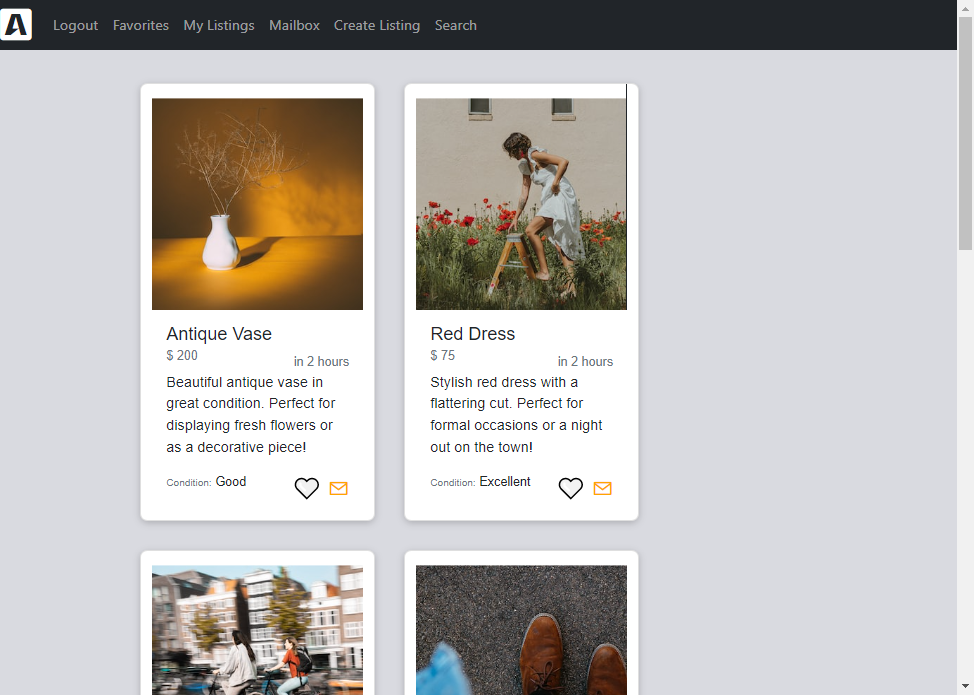
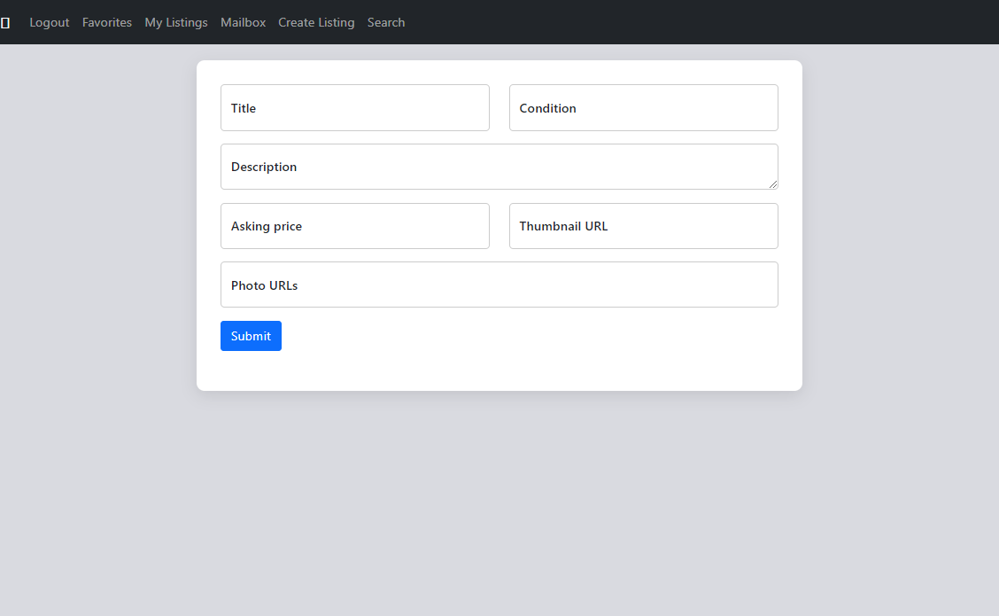
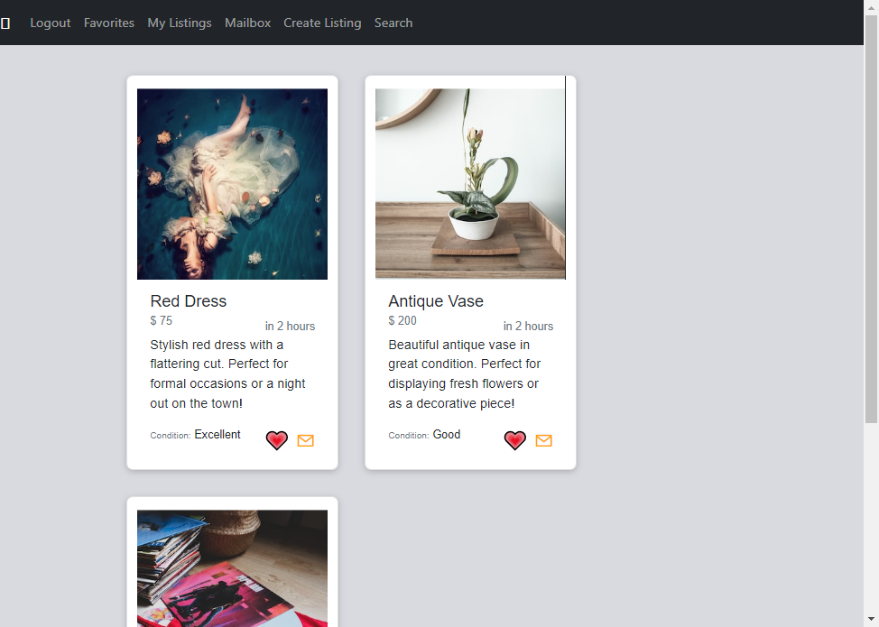
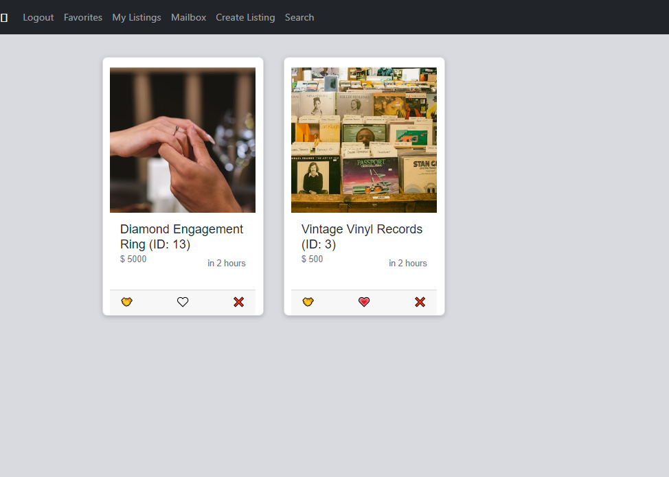
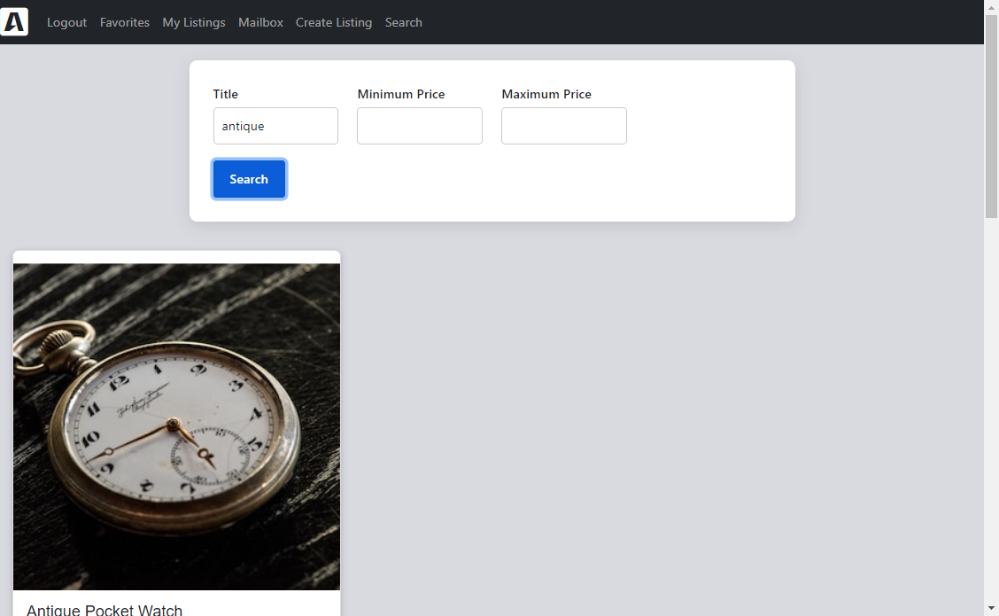
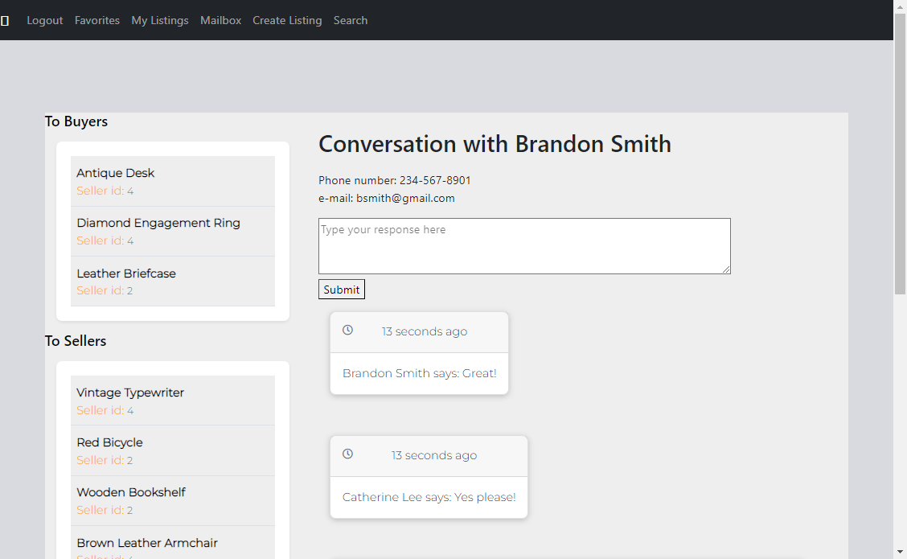

# BUYR The Lighthouse Buy and Sell WebApp

BUYR is a Craigslist/Kijiji clone where users can list items for sale and browse items for sale from others!

## Getting Started

1. Clone this repo: `git clone git@github.com:Desyn6/LHL-Jan23-Midterm.git`
2. This app uses PostgreSQL - please refer to [PostgreSQL Setup](###PostgreSQL-Setup).
3. Open the application directory: `cd /LHL-Jan23-Midterm`.
4. Ensure that you are using node version 16 or later: `node -v`.
5. Install the dependencies: `npm install`.
6. Fix to binaries for sass: `npm rebuild node-sass`
7. Copy the .env file `cp .env.example .env`
8. If you are using your own PostgreSQL credentials, update the `DB_USER` and `DB_PASS` fields in .env accordingly.
9. Create and seed your database: `npm run db:reset`
10. Run the application: `npm run local`.
11. Access the application in your browser at `localhost:[PORT]`. The default port is `8080`.  

### PostgreSQL Setup
1. You will require PostgreSQL to use this application; please ensure that it is installed. If not, you can download PostgreSQL [here](https://www.postgresql.org/about/).
2. Start PostgreSQL: `psql` - please note that if you are on WSL, you will need to use the following command first: `startposgresql`.

## Features
1. Listing your items for sale! All items you list can be managed using the My Listings page.
2. Delete your listings or mark them as sold!
3. Bookmark others' listings for browsing at a later time!
4. Send messages in-app to sellers, and respond to buyer requests!

## Environment
- Node v12.22.xx or higher

## Dependencies
- bcrypt: v5.1.0
- chalk: v2.4.2
- cookie-session: v2.0.0
- dotenv: v2.0.0
- ejs: v2.6.2
- express: v4.17.1
- morgan: v1.9.1
- pg: v8.5.0
- sass: v1.35.1

## Interface Images
The following screenshots show various parts of the app interface.

Landing Page

Create New Listing Page

Favorites Page

Manage Listings Page

Search Page

In-App Messaging Service

